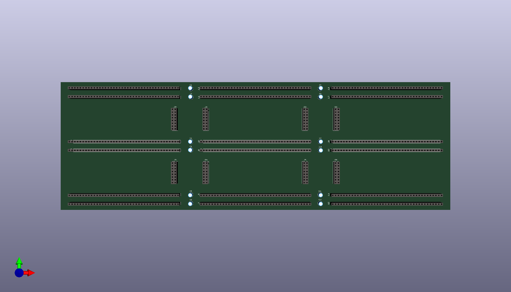
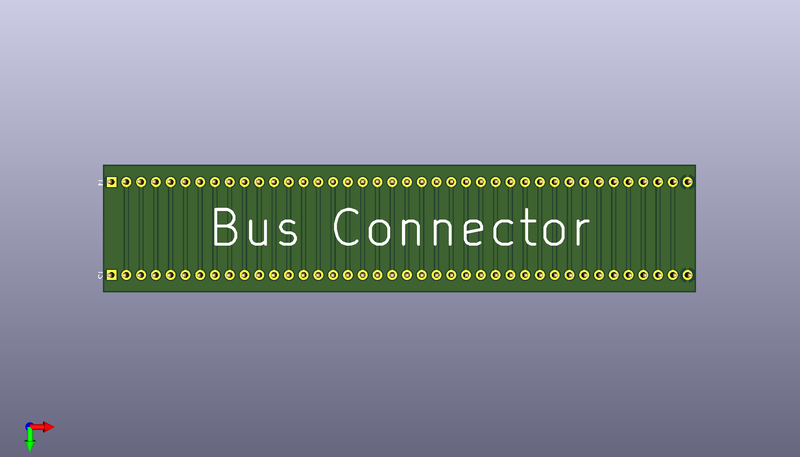

# nqsap-pcb-WIP
NQSAP 8-bit computer PCB version (Work in Progress)

A multi-PCB version of the [NQSAP 8-bit computer](https://tomnisbet.github.io/nqsap/).
This design is based on an [8-bit PCB implementation by djh82uk](https://www.reddit.com/r/beneater/comments/pn4j6j/finally_complete_with_all_bugs_fixed/)

## Baseboard

Each baseboard can hold three modules across.  Any module slot can also hold two half-height modules.  The full size module boards measure 90mm from the top row of pins to the bottom row.  The total board height is 96mm.

A 16-pin header is provided between each half-height board to make module-to-module connections.  A full height board can use both sets of connectors for a total of 32 pins.  The interconnects have the inner pins connected and the outer pins connected.  A module needing 8 or fewer connections could populate just a 1x8 connector instead of a 2x8 to save space.

Note that the interconnects are not connected all the way across the baseboard.  If the left board and right board need to talk, the signals will need to route through the middle board.

## Bus connectors

The bus connector boards are used to connect baseboards together to expand the computer vertically.  Three connectors are used between each pair of baseboards.  The bus connector wires all 40 lines top-to-bottom.

[")](bus-connect-back.png)

The bus connector boards have additional functionality on the reverse side.  With the board flipped and the pin headers installed on the other side, LEDs and resistors can be added to display the status of the data bus.

By replacing the LEDs with zero ohm resistors and using 1K resistors in place of R1 to R8, the bus connector can also provide bus termination.
